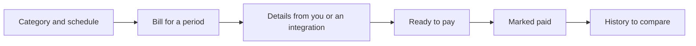

# Oblidog

[](https://oblidog.com)

## Keep your payments on a leash

**A self-hosted app for recurring bills and household obligations. Know what's due, what changed, and what you've paid.**


## A look around

<!-- Screenshots to add: current Oblidog Dashboard, showing upcoming and overdue bills. -->
<!-- Screenshots to add: Obligations, showing a billing period, payment states, and a bill's components. -->
<!-- Screenshots to add: Custom data history and/or component comparison, showing changes between records or periods. -->


## Why Oblidog?

Oblidog isn't a budgeting app. It's an operational dashboard for bills you need to handle, from first amount to paid.

- **Know what needs attention:** see upcoming, overdue, ready-to-pay, and paid bills.
- **See what changed:** compare amounts, bill components, and provider data across periods instead of overwriting last month's row.
- **Keep control:** run Oblidog yourself and own the data.

## Core concepts

### Ledger

A ledger is the shared workspace. It owns categories and obligations and defines
who can access them.

### Category

A category describes a recurring type of obligation. Categories belong to
category groups and provide the metadata used when obligations are created.
They can also define a schema for structured data collected for that type of
obligation.

### Obligation

An obligation represents one concrete payment or responsibility for a billing
period. Its lifecycle separates incomplete data from an item that is ready to
pay, paid, canceled, or reopened.

### Components and structured data

Not every obligation is just a single amount. Components allow an obligation to
carry a breakdown of its total, while category-defined structured data can hold
domain-specific information such as invoice details, consumption, readings, or
other integration-provided values.

## How it works



For a September electricity bill, you or an integration add the amount and components; an integration can also record meter readings. After payment, you or the integration mark it paid, and September's details remain available to compare with October. Oblidog does not initiate bank payments.

## Integrations and automation

Oblidog works with manual entries. For automation, external jobs can use a scoped connection key to update obligations, add bill components and structured provider records, and change an obligation's state. An integration can report its last run and health to Oblidog; the app has an integrations view for monitoring those reports. You choose and run the provider-specific jobs separately—Oblidog does not ship a universal bill collector.

The built-in System Run creates scheduled obligations, estimates missing amounts, and can send reports when email is configured. It does not launch external integration jobs. See the [integration API guide](docs/integration-api.md) and [self-hosting guide](docs/self-hosting.md) for setup details.

## What you can do

- Review upcoming, overdue, ready-to-pay, and paid obligations across billing periods.
- See amount history, compare recurring bill components, and inspect changes to structured provider records.
- Mark bills ready, paid, canceled, or reopened; review an obligation's action history.
- Share a ledger with owner, editor, and viewer roles.
- Run your own deployment with Docker Compose, with included or external PostgreSQL.

## Quick start: self-host

The installer sets up a standalone Docker Compose deployment with PostgreSQL
and persistent database storage. Docker Engine with the Compose plugin is the
only prerequisite; a source checkout is not required.

```bash
mkdir oblidog-ledger
cd oblidog-ledger
curl -fsSL https://raw.githubusercontent.com/oblidog/oblidog-ledger/main/scripts/install.sh | bash
```

Edit `.env`: replace the placeholder secrets, choose a published immutable
`TAG`, and review the public URLs and bind addresses. Then validate the
configuration and start the stack:

```bash
./validate-deployment.sh standalone
docker compose pull
docker compose up -d
docker compose ps
```

The `prestart` service applies database migrations before the app starts. With
the template defaults, open `http://localhost:8080`. The database has no
published host port. The stack also includes a System Run scheduler.

An external PostgreSQL and reverse proxy variant remains available for existing
setups. Read the [self-hosting guide](docs/self-hosting.md) for both variants,
proxy configuration, scheduler settings, upgrades, and the
[database backup and recovery runbook](docs/operations/database-recovery.md)
before deploying.

## Project status

Oblidog is in active early development. The core bill workflow, shared ledgers, history views, and integration API are available. Provider-specific jobs run outside Oblidog. Expect the interface and integration setup to evolve.

## Documentation

- [Self-hosting and operations](docs/self-hosting.md)
- [Integration API guide](docs/integration-api.md) · [OpenAPI specification](openapi/integration.json)
- [Obligation states and actions](docs/obligation-lifecycle.md)
- [Structured category data](docs/category-data-records.md)
- [Obligation action history](docs/obligation-action-log.md)
- [Development setup](development.md) · [Backend](backend/README.md) · [Frontend](frontend/README.md)

Oblidog is developed in public by the [Oblidog GitHub organisation](https://github.com/oblidog) and released under the [MIT license](LICENSE).
