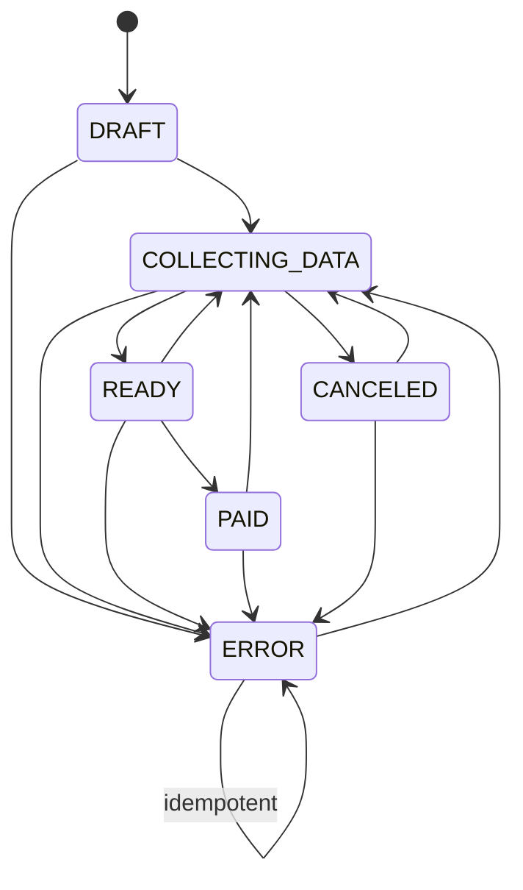

# Obligation lifecycle

This document is the source of truth for `Obligation.lifecycle`. State changes
belong to use cases; the ordinary `PATCH` endpoint never accepts a `lifecycle`
field.

## States

| State | Meaning | Editable through `PATCH` |
| --- | --- | --- |
| `DRAFT` | An obligation created for a future period; data collection has not started. | Yes |
| `COLLECTING_DATA` | Payment data is being collected or corrected. | Yes |
| `READY` | Amount and due date are confirmed; issue date is also confirmed when present; the obligation is ready to be paid. | No |
| `PAID` | The obligation has been marked as paid. | No |
| `CANCELED` | The obligation was canceled and may be reopened. | No |
| `ERROR` | An integration detected invalid or inconsistent obligation data and raised an alarm. It does not represent integration health. | No |

## Allowed transitions

| From | To | Mechanism | Status |
| --- | --- | --- | --- |
| `DRAFT` | `COLLECTING_DATA` | `update_manual_obligation` after an actual manual change | Implemented |
| `DRAFT` | `ERROR` | `mark_obligation_error` | Implemented |
| `COLLECTING_DATA` | `READY` | `mark_obligation_ready` | Implemented |
| `COLLECTING_DATA` | `CANCELED` | `cancel_obligation` | Implemented |
| `COLLECTING_DATA` | `ERROR` | `mark_obligation_error` | Implemented |
| `READY` | `PAID` | `mark_obligation_paid` | Implemented |
| `READY` | `COLLECTING_DATA` | `reopen_obligation` | Implemented |
| `READY` | `ERROR` | `mark_obligation_error` | Implemented |
| `PAID` | `COLLECTING_DATA` | `reopen_obligation` | Implemented |
| `PAID` | `ERROR` | `mark_obligation_error` | Implemented |
| `CANCELED` | `COLLECTING_DATA` | `reopen_obligation` | Implemented |
| `CANCELED` | `ERROR` | `mark_obligation_error` | Implemented |
| `ERROR` | `ERROR` | `mark_obligation_error` | Implemented (idempotent) |
| `ERROR` | `COLLECTING_DATA` | `reopen_obligation` | Implemented |

No other transitions are allowed. In particular, `READY`, `PAID`, `CANCELED`,
and `ERROR` cannot be changed through the ordinary `PATCH` endpoint.

## Use cases and their effects

| Use case | Allowed input state | Result | Fields changed |
| --- | --- | --- | --- |
| `ensure_obligations_for_period` | — (creation) | Current period: `COLLECTING_DATA`; next period: `DRAFT` | Creates missing records with initial values; does not change existing ones |
| `create_manual_obligation` | — (creation) | `COLLECTING_DATA`, or `READY` when `data_ready=true` | `lifecycle`, supplied manual values, their `*_state`/`*_source`, `effective_value_source`, and `notes` |
| `update_manual_obligation` | `DRAFT`, `COLLECTING_DATA` | An edited `DRAFT` moves to `COLLECTING_DATA`; the latter remains unchanged | Supplied manual values, their `*_state`/`*_source`, `effective_value_source`, `notes`, and—after an actual draft change—`lifecycle` |
| `mark_obligation_ready` | `COLLECTING_DATA` | `READY` | `lifecycle`, `amount_state=CONFIRMED`, `due_date_state=CONFIRMED`, and `issue_date_state=CONFIRMED` when `issue_date` is present |
| `mark_obligation_paid` | `READY`; repeated calls for `PAID` are idempotent | `PAID` | On the first call: `lifecycle`, `paid_at=now(UTC)` |
| `cancel_obligation` | `COLLECTING_DATA` | `CANCELED` | `lifecycle` |
| `reopen_obligation` | `READY`, `PAID`, `CANCELED`, `ERROR` | `COLLECTING_DATA` | `lifecycle`, `paid_at=None`; does not change amount, dates, their states, or sources |
| `mark_obligation_error` | Every lifecycle; repeated calls for `ERROR` are idempotent | `ERROR` | On the first call: `lifecycle`; preserves `paid_at`, values, states, sources, components, and notes |

`*_state` refers to `amount_state`, `issue_date_state`, or `due_date_state`.
`*_source` refers to the matching value source. Manual changes set the source to
`MANUAL`; the use case moves the state between `UNKNOWN`, `ESTIMATED`, and
`OVERRIDDEN` as appropriate.

## HTTP actions

All current actions require the ledger's `EDITOR` or `OWNER` role.

| Endpoint | Use case | Notes |
| --- | --- | --- |
| `PATCH /api/v1/ledgers/{ledger_id}/obligations/{obligation_key}` | `update_manual_obligation` | Only `DRAFT` and `COLLECTING_DATA` |
| `PATCH /api/v1/ledgers/{ledger_id}/obligations/{obligation_key}/ready` | `mark_obligation_ready` | Requires at least an estimated amount and due date |
| `POST /api/v1/ledgers/{ledger_id}/obligations/{obligation_key}/mark-paid` | `mark_obligation_paid` | Idempotent for `PAID` |
| `POST /api/v1/ledgers/{ledger_id}/obligations/{obligation_key}/cancel` | `cancel_obligation` | Only `COLLECTING_DATA` |
| `POST /api/v1/ledgers/{ledger_id}/obligations/{obligation_key}/reopen` | `reopen_obligation` | Reopens `READY`, `PAID`, `CANCELED`, or `ERROR` |

| `POST /api/v1/integration/obligations/{obligation_key}/error` | `mark_obligation_error` | Requires `ledger:write`; accepts every lifecycle and is idempotent for `ERROR` |

`ERROR` is an alarm about invalid obligation data, not integration health. The
latter belongs to the separate integration-state model. Integration diagnostics
may be appended through the integration-only notes endpoint.
