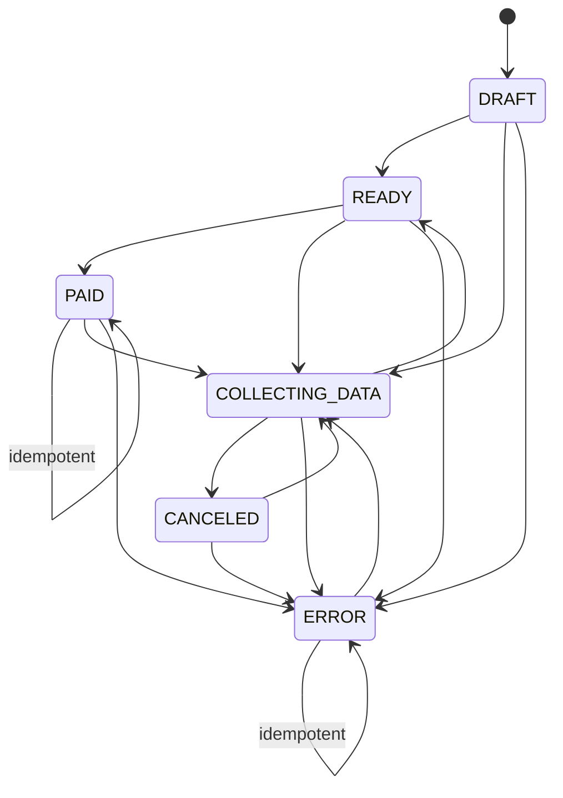

# Obligation lifecycle

This document is the source of truth for `Obligation.lifecycle`. State changes
belong to use cases; the ordinary `PATCH` endpoint never accepts a `lifecycle`
field.

## States

| State | Meaning | Editable through `PATCH` |
| --- | --- | --- |
| `DRAFT` | An obligation created for a future period; data collection has not started. | Yes |
| `COLLECTING_DATA` | Payment data is being collected or corrected. | Yes |
| `READY` | Amount and due date are confirmed; issue date is also confirmed when present; the obligation is ready to be paid. | No |
| `PAID` | The obligation has been marked as paid. | No |
| `CANCELED` | The obligation was canceled and may be reopened. | No |
| `ERROR` | An integration detected invalid or inconsistent obligation data and raised an alarm. It does not represent integration health. | No |

## Allowed transitions

```mermaid
stateDiagram-v2
    [*] --> DRAFT
    DRAFT --> READY
    DRAFT --> COLLECTING_DATA
    DRAFT --> ERROR
    COLLECTING_DATA --> READY
    COLLECTING_DATA --> CANCELED
    COLLECTING_DATA --> ERROR
    READY --> PAID
    PAID --> PAID: idempotent
    READY --> COLLECTING_DATA
    READY --> ERROR
    PAID --> COLLECTING_DATA
    PAID --> ERROR
    CANCELED --> COLLECTING_DATA
    CANCELED --> ERROR
    ERROR --> ERROR: idempotent
    ERROR --> COLLECTING_DATA
```

| From | To | Mechanism | Status |
| --- | --- | --- | --- |
| `DRAFT` | `COLLECTING_DATA` | Manual or integration value update after an actual change | Implemented |
| `DRAFT` | `READY` | `mark_obligation_ready` with complete data; no edit required | Implemented |
| `DRAFT` | `ERROR` | `mark_obligation_error` | Implemented |
| `COLLECTING_DATA` | `READY` | `mark_obligation_ready` | Implemented |
| `COLLECTING_DATA` | `CANCELED` | `cancel_obligation` | Implemented |
| `COLLECTING_DATA` | `ERROR` | `mark_obligation_error` | Implemented |
| `READY` | `PAID` | `mark_obligation_paid` | Implemented |
| `PAID` | `PAID` | Repeated `mark_obligation_paid` | Implemented (idempotent) |
| `READY` | `COLLECTING_DATA` | `reopen_obligation` | Implemented |
| `READY` | `ERROR` | `mark_obligation_error` | Implemented |
| `PAID` | `COLLECTING_DATA` | `reopen_obligation` | Implemented |
| `PAID` | `ERROR` | `mark_obligation_error` | Implemented |
| `CANCELED` | `COLLECTING_DATA` | `reopen_obligation` | Implemented |
| `CANCELED` | `ERROR` | `mark_obligation_error` | Implemented |
| `ERROR` | `ERROR` | `mark_obligation_error` | Implemented (idempotent) |
| `ERROR` | `COLLECTING_DATA` | `reopen_obligation` | Implemented |

No other transitions are allowed. In particular, `READY`, `PAID`, `CANCELED`,
and `ERROR` cannot be changed through the ordinary `PATCH` endpoint.

## Use cases and their effects

| Use case | Allowed input state | Result | Fields changed |
| --- | --- | --- | --- |
| `ensure_obligations_for_period` | — (creation) | Current period: `COLLECTING_DATA`; next period: `DRAFT` | Creates missing records with initial values; does not change existing ones |
| `create_manual_obligation` | — (creation) | `COLLECTING_DATA`, or `READY` when `data_ready=true` | `lifecycle`, supplied manual values, their `*_state`/`*_source`, `effective_value_source`, and `notes` |
| `update_manual_obligation` / `update_integration_obligation` | `DRAFT`, `COLLECTING_DATA` | An edited `DRAFT` moves to `COLLECTING_DATA`; the latter remains unchanged | Supplied values, their `*_state`/`*_source`, `effective_value_source`, and—after an actual draft change—`lifecycle`; manual updates may also change `notes` |
| `mark_obligation_ready` | `DRAFT`, `COLLECTING_DATA` | `READY` | `lifecycle`, `amount_state=CONFIRMED`, `due_date_state=CONFIRMED`, and `issue_date_state=CONFIRMED` when `issue_date` is present |
| `mark_obligation_paid` | `READY`; repeated calls for `PAID` are idempotent | `PAID` | On the first call: `lifecycle`, `paid_at=now(UTC)` |
| `cancel_obligation` | `COLLECTING_DATA` | `CANCELED` | `lifecycle` |
| `reopen_obligation` | `READY`, `PAID`, `CANCELED`, `ERROR` | `COLLECTING_DATA` | `lifecycle`, `paid_at=None`; does not change amount, dates, their states, or sources |
| `mark_obligation_error` | Every lifecycle; repeated calls for `ERROR` are idempotent | `ERROR` | On the first call: `lifecycle`; preserves `paid_at`, values, states, sources, components, and notes |

`*_state` refers to `amount_state`, `issue_date_state`, or `due_date_state`.
`*_source` refers to the matching value source. Manual changes set the source to
`MANUAL`; the use case moves the state between `UNKNOWN`, `ESTIMATED`, and
`OVERRIDDEN` as appropriate.

## HTTP actions

All current actions require the ledger's `EDITOR` or `OWNER` role.

| Endpoint | Use case | Notes |
| --- | --- | --- |
| `PATCH /api/v1/ledgers/{ledger_id}/obligations/{obligation_key}` | `update_manual_obligation` | Only `DRAFT` and `COLLECTING_DATA` |
| `PATCH /api/v1/ledgers/{ledger_id}/obligations/{obligation_key}/ready` | `mark_obligation_ready` | Accepts `DRAFT` and `COLLECTING_DATA`; requires at least an estimated amount and due date |
| `POST /api/v1/ledgers/{ledger_id}/obligations/{obligation_key}/mark-paid` | `mark_obligation_paid` | Idempotent for `PAID` |
| `POST /api/v1/ledgers/{ledger_id}/obligations/{obligation_key}/cancel` | `cancel_obligation` | Only `COLLECTING_DATA` |
| `POST /api/v1/ledgers/{ledger_id}/obligations/{obligation_key}/reopen` | `reopen_obligation` | Reopens `READY`, `PAID`, `CANCELED`, or `ERROR` |

Integration routes use a connection key bound to one category, rather than a
ledger member role. Their obligation endpoints address a billing period as
`{period}` (`YYYY-MM`), for example
`POST /api/v1/integration/obligations/{period}/error`. This marks the obligation
`ERROR` from any state and is idempotent when already `ERROR`. See the
[integration API](integration-api.md) for the other contextual operations.

`ERROR` is an alarm about invalid obligation data, not integration health. The
latter belongs to the separate integration-state model. Integration diagnostics
may be appended through the integration-only notes endpoint.

## Payment schedule and due-date preview

Category recurrence is anchored to `first_due_date` and advances by the configured
number of months or years. Each occurrence keeps the original day of the month,
clamped to the last valid day in a short month. The effective due date moves back
to the nearest working day, skipping weekends and public holidays according to
the ledger's `business_calendar_country`. This may put the due date in the
previous month; the obligation still belongs to its original billing period.

`POST /api/v1/ledgers/{ledger_id}/categories/schedule-preview` accepts
`first_due_date`, `recurrence_interval`, `recurrence_unit`, and an optional
`reference_date`. Without a reference date it uses today's date in
`SYSTEM_RUN_TIMEZONE`. It returns `period_year`, `period_month`, `scheduled_date`,
`due_date`, and `calendar_country` for the first effective due date on or after
that date, including today. Date and period fields are null if the next occurrence
would exceed the supported date range.

The preview requires ledger view access, supports unsaved category forms, and
performs no writes. It uses the same domain calculator as obligation generation
and remains available in a read-only demo. It forecasts newly generated dates;
it does not report existing obligations or overwrite dates already stored,
including dates supplied by users or integrations. The validation window for
manual due dates remains a separate rule.

## Ledger preferences

Each ledger persists `business_calendar_country` and `default_currency`. Owners
can choose these when creating a ledger and edit them in Settings → Preferences.
Viewers and editors can read them but cannot change them. Countries are the
canonical two-letter codes supported by `holidays`; currencies are the existing
supported currencies. `GET /api/v1/ledgers/preference-options` returns both lists
and initial defaults for an authenticated user.

The migration copies `BUSINESS_CALENDAR_COUNTRY` into existing ledgers and sets
`default_currency` to `PLN`, preserving the previous defaults. The environment
variable remains only a bootstrap default for creating a new ledger. Changing
it later does not alter saved ledgers. Calendar changes affect newly generated
obligation dates, schedule previews and report working-day calculations, without
rewriting existing dates. Reports select the calendar separately for each ledger.

A new category copies the ledger default currency when currency is omitted (or
null) in the API request. An explicit category currency overrides the default.
Omitting currency in a category update preserves its existing currency. Changing
a ledger's default currency never modifies existing categories or obligations,
and does not convert or combine amounts across currencies.
